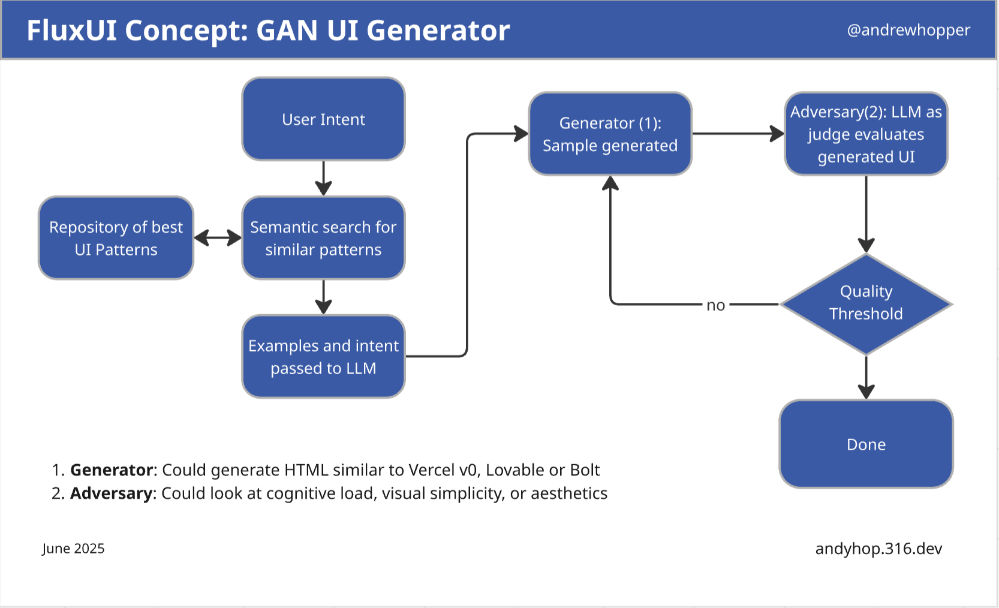

# FluxUI: GAN UI Generator

A novel approach to UI generation using Generative Adversarial Networks (GANs) with Large Language Models (LLMs).

## Author

**Andrew Hopper** (@andrewhopper)  
🌐 [andyhop.316.dev](https://andyhop.316.dev)

## Concept Overview

FluxUI implements a GAN-inspired architecture where two LLMs work in opposition to generate high-quality UI code:

- **Generator (LLM 1)**: Creates UI code based on user intent and similar patterns
- **Adversary (LLM 2)**: Acts as a quality judge, evaluating the generated UI

## Architecture Flow

1. **User Intent** → Semantic search for similar patterns
2. **Pattern Repository** → Examples and intent passed to Generator LLM  
3. **Generator** → Produces UI code (HTML similar to Vercel v0, Lovable, or Bolt)
4. **Adversary** → Evaluates generated UI on criteria like:
   - Cognitive load
   - Visual simplicity  
   - Aesthetics
5. **Quality Threshold** → If not met, loops back to Generator; if met, process complete

## Key Features

- **Semantic Pattern Search**: Leverages a repository of best UI patterns
- **Adversarial Training**: Continuous improvement through LLM evaluation
- **Quality-Driven**: Only outputs UI that meets defined quality thresholds
- **Intent-Based**: Generates UI based on natural language user descriptions

## Getting Started

This project is in early development stage. The system aims to bridge the gap between user intent and high-quality UI generation through adversarial machine learning principles.

## License

This project is licensed under the MIT License - see the [LICENSE](LICENSE) file for details. 